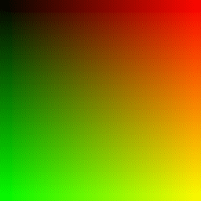
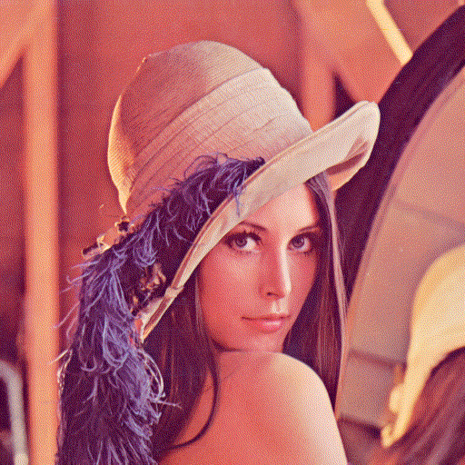
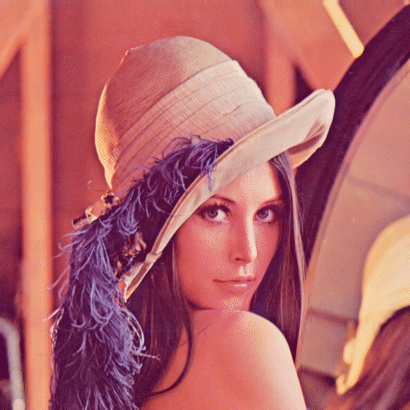

# gifencoder

gifencoder is a pure Java library implementing the [GIF89a specification](http://www.w3.org/Graphics/GIF/spec-gif89a.txt). It does not use AWT's `BufferedImage`, so it can be used on Android and other platforms lacking AWT.

There is currently no support for transparency.


### Quantization and dithering

GIF images are limited to 256 colors. If you supply an image with more colors, gifencoder's default behavior is to perform [median-cut quantization](http://en.wikipedia.org/wiki/Median_cut) with [Floyd-Steinberg dithering](http://en.wikipedia.org/wiki/Floyd%E2%80%93Steinberg_dithering). You can configure this behavior through `ImageOptions`. A handful of quantizers and ditherers are provided, but you can also plug in your own implementation.


### Basic usage

```java
int[][] rgbDataFrame1 = ...;
int[][] rgbDataFrame2 = ...;
int[][] rgbDataFrame3 = ...;

OutputStream outputStream = new FileOutputStream("test.gif");
ImageOptions options = new ImageOptions();
new GifEncoder(outputStream, width, height, 0)
        .addImage(rgbDataFrame1, options)
        .addImage(rgbDataFrame2, options)
        .addImage(rgbDataFrame3, options)
        .finishEncoding();
outputStream.close();
```


### Download

Gradle:
```groovy
compile 'com.squareup:gifencoder:0.10.1'
```
Maven:
```xml
<dependency>
  <groupId>com.squareup</groupId>
  <artifactId>gifencoder</artifactId>
  <version>0.10.1</version>
</dependency>
```
Or download [the latest JAR][jar]. 

Snapshots of the development version are available in [Sonatype's `snapshots` repository][snap].


### Gallery

Simple animation with median-cut quantization and Floyd-Steinberg dithering:



Lenna, original PNG:


Lenna with uniform quantization and Floyd-Steinberg dithering:



Lenna GIF with median-cut quantization and Floyd-Steinberg dithering:



Lenna GIF with k-means quantization and Floyd-Steinberg dithering:


License
=======

    Copyright 2015 Square, Inc.

    Licensed under the Apache License, Version 2.0 (the "License");
    you may not use this file except in compliance with the License.
    You may obtain a copy of the License at

       http://www.apache.org/licenses/LICENSE-2.0

    Unless required by applicable law or agreed to in writing, software
    distributed under the License is distributed on an "AS IS" BASIS,
    WITHOUT WARRANTIES OR CONDITIONS OF ANY KIND, either express or implied.
    See the License for the specific language governing permissions and
    limitations under the License.


 [jar]: https://search.maven.org/remote_content?g=com.squareup&a=gifencoder&v=LATEST
 [snap]: https://oss.sonatype.org/content/repositories/snapshots/
